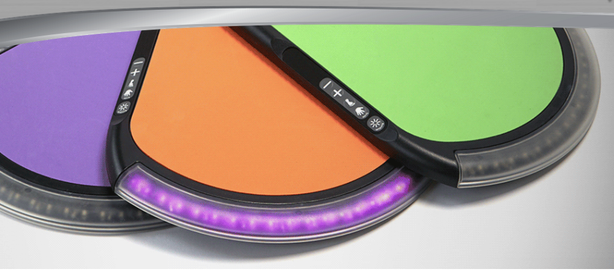
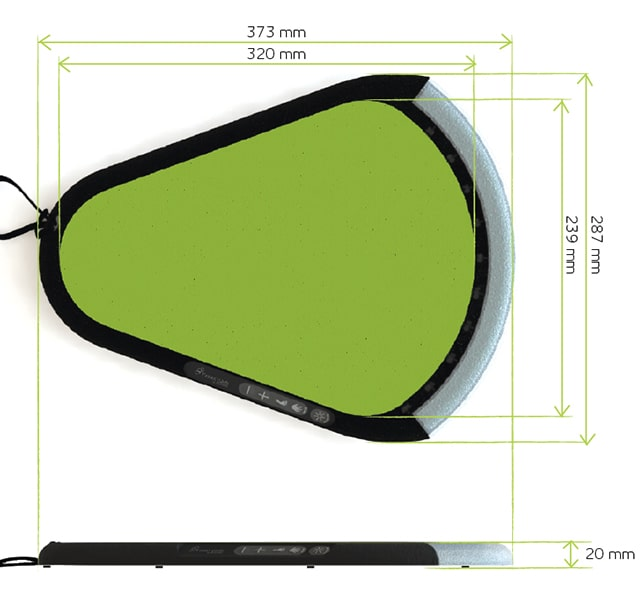
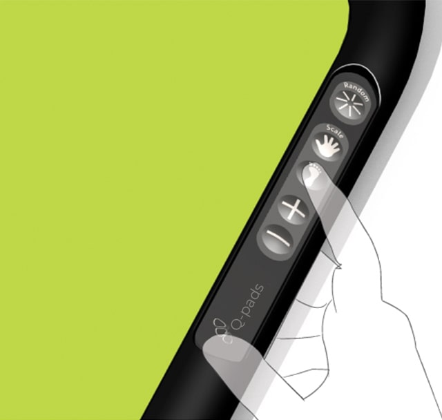
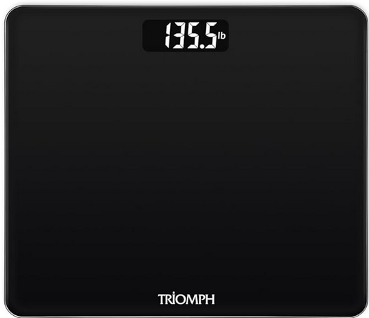
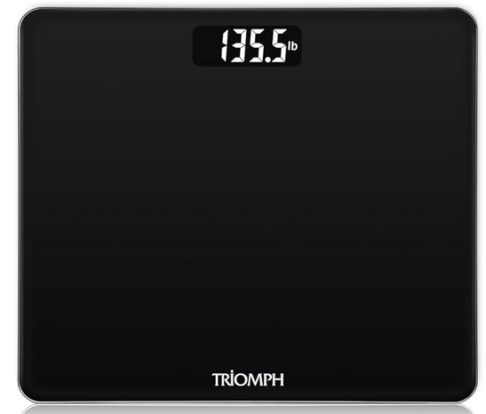

# Making the Balance LiteGait

## What Helene wants

Q-Pads from LiteGait:

- Compact
- Portable
- Visual indicator to see fast the pressure applied
- Use for Hand
- Use for Foot
- Pressur applied to one pad
- Pressur applied to two pads
- Pressur applied to two pads differential

## What I think needs to be done

Take a scale look whats inside take necessary and add a pcb to be able display the pressure applied. The pcb will be able to do some upgrades with software. The MVP(Minimum viable product) will only be able to display one pad on the LED Strip. On futur upgrades it would be able to talk to another board and do the differential.

### Exemple of scales

\
[TRIOMPH](https://www.amazon.ca/-/fr/Triomph-P%C3%A8se-personne-num%C3%A9rique-technologie-moniteur/dp/B07CVFQ2PC/ref=sr_1_6?__mk_fr_CA=%C3%85M%C3%85%C5%BD%C3%95%C3%91&crid=234W8TBM1J7RH&dib=eyJ2IjoiMSJ9.Er16wYgl9AEouCoda6gg5zmlslpjj-8U5XG1qicv2KVkrDKik-l-NX6fAeO2-VO6ho25mIjouzNdiroaXbPBaDhb6r8iPb6TzHecbTHem1Hfu6RIK-CGQUS1PKtddBIQ-u7pUjOImVzcyHvhktIcm-315UoudFgudaYybTZldiGhGAcI9_g_De-Omeen57sxOnBNYmtzp9B6xCa6QvNu8K_dQEaJnbuEyLL4oo27STrH8u4uaSn5klihBY8bfo0qOH6NVtEgAmLHfa7S3TXwqhINkiF0TfWrUNxeN3eQC9Y.zcyuSPU4XDcnSnTMgiSn4oeeTl_AQC1ymhQE90xwTVk&dib_tag=se&keywords=scale&qid=1751075684&sprefix=scale%2Caps%2C113&sr=8-6&th=1)

Specs:
- Price: 17.99$
- Precision: 0.1 kg
- Max weight: 180 kg
- Power: 2 AAA
- Capteurs: 4 cpateurs
- Dimensions: 300 x 260 x 18 mm

\
[RENPHO](https://www.amazon.ca/-/fr/RENPHO-P%C3%A8se-personne-num%C3%A9rique-%C3%A9clair%C3%A9-arrondi/dp/B07S9PTLNZ/ref=sr_1_8?__mk_fr_CA=%C3%85M%C3%85%C5%BD%C3%95%C3%91&crid=234W8TBM1J7RH&dib=eyJ2IjoiMSJ9.Er16wYgl9AEouCoda6gg5zmlslpjj-8U5XG1qicv2KVkrDKik-l-NX6fAeO2-VO6ho25mIjouzNdiroaXbPBaDhb6r8iPb6TzHecbTHem1Hfu6RIK-CGQUS1PKtddBIQ-u7pUjOImVzcyHvhktIcm-315UoudFgudaYybTZldiGhGAcI9_g_De-Omeen57sxOnBNYmtzp9B6xCa6QvNu8K_dQEaJnbuEyLL4oo27STrH8u4uaSn5klihBY8bfo0qOH6NVtEgAmLHfa7S3TXwqhINkiF0TfWrUNxeN3eQC9Y.zcyuSPU4XDcnSnTMgiSn4oeeTl_AQC1ymhQE90xwTVk&dib_tag=se&keywords=scale&qid=1751075684&sprefix=scale%2Caps%2C113&sr=8-8&th=1)

Specs:
- Price: 19.99$
- Precision: 0.05 kg
- Max weight: 180 kg
- Power: 3 AAA
- Capteurs: 4 cpateurs
- Dimensions: 260 x 260 x 21 mm

# Steps to make it work

### Before Ordering the Balance
    - Choose a balance  
    - Order balance  

### Balance Ordered
    - Start conceiving PCB  
    - Choose components with minimal power consumption  

### Balance Received
    - Open the balance  
    - Make code for prototype (reading only)  
    - Read the data on prototype board  
    - Modify PCB to make the balance work  
    - Add all buttons required for user convenience  
    - Order PCB  

### PCB Ordered
    - Improve mechanical design for better user experience  
    - Make it less slippery  
    - Make it as compact as possible  
    - Receive PCB and assemble it  
    - Connect all required wires  

### Ship to Helene
    - Test the product  

### All Works
    - Order the components and assemble  
    - Flash firmware and add features if required  

# Features that could be added:
- Communication between other boards
- Rechargeable (instead of AAA bateries)
- Differential between boards
- Show graphs on that could be uploaded to computer

# Making it from scratch

[aliexpress](https://www.aliexpress.com/item/1005006593556468.html?spm=a2g0o.detail.pcDetailTopMoreOtherSeller.1.1880I75sI75sFr&gps-id=pcDetailTopMoreOtherSeller&scm=1007.40050.354490.0&scm_id=1007.40050.354490.0&scm-url=1007.40050.354490.0&pvid=ac17a961-eb2f-4cc0-b021-225fe7abeef9&_t=gps-id:pcDetailTopMoreOtherSeller,scm-url:1007.40050.354490.0,pvid:ac17a961-eb2f-4cc0-b021-225fe7abeef9,tpp_buckets:668%232846%238111%231996&pdp_ext_f=%7B%22order%22%3A%22789%22%2C%22eval%22%3A%221%22%2C%22sceneId%22%3A%2230050%22%7D&pdp_npi=4%40dis%21CAD%214.29%214.29%21%21%213.08%213.08%21%402101efeb17510833965306844e1299%2112000045274262420%21rec%21CA%216182905152%21XZ&utparam-url=scene%3ApcDetailTopMoreOtherSeller%7Cquery_from%3A)

[ebay](https://www.ebay.ca/itm/205456411197?_trkparms=amclksrc%3DITM%26aid%3D1110006%26algo%3DHOMESPLICE.SIM%26ao%3D1%26asc%3D288100%26meid%3Db7fefeaa61a5426c962784ce381302c7%26pid%3D101196%26rk%3D4%26rkt%3D30%26sd%3D286077381781%26itm%3D205456411197%26pmt%3D1%26noa%3D0%26pg%3D2332490%26algv%3DSimplAMLv11WebTrimmedV3MskuWithLambda85KnnRecallV1V2V4ItemNrtInQueryAndCassiniVisualRankerAndBertRecallWithVMEV3EmbeddedAuctionsCPCAutoWithCassiniEmbRecallManualForBrowsableSim%26brand%3DUnbranded&_trksid=p2332490.c101196.m2219&itmprp=cksum%3A205456411197b7fefeaa61a5426c962784ce381302c7%7Cenc%3AAQAKAAABsICPe7P5yg950EEg9BevwDnPVpYtBL6R3L1WZiQpfUimaEnO7deblbALMGZJcV93MU6pPxDtOEcf5oucrRYzZTD%252FyZBriVGH%252F2mwifhmRwTkaWRpqJTQUifr%252BOt3ccP5fkaCnIhcKRPN8pKZNKWeBhqrMyMAJdJdAhzQhK0kPYuzci%252FIt%252Fz2A4e3LlrDvHFEV1A2F9SHp7Xg5usDt9Q2abfXkDZ%252BOL957fIwSMJdjhjyWfRWFiN%252FT%252Bi2lNgdP3WeJ1R20CtbkYzwXgj7l66VXjRPhBt3Q%252Bh8cxSvcANyJS5fDrXiF2WoCqtGkNjO3ojD7uxyMPaX%252B2B%252BwjvuQFDPgILz2b7VmqJIGINoBv2Uy1i5N2kIJcvZqMUFjK5PZkx1IzoxMkxem2%252F2deZX331OpBmtcUof9aSvO707ZwRo6517OzYU33%252BZC0BPWFZBv6GW7eoiXsM1t%252BFBlzPgSFz9Kbp4OXPQAG4duDsFsjIH58aE4eY7yt1vN663nU%252BsRM8VW%252F4Ye0PFRGqogTgjw1iV9q%252FqsTKcTaIcvYmQdRKRjESjBY4%252FyAI%252F5UBCoyPvCtxAfw%253D%253D%7Campid%3APL_CLK%7Cclp%3A2332490&itmmeta=01JYTAECSPB4D7Z8M8PBP6T1TB)